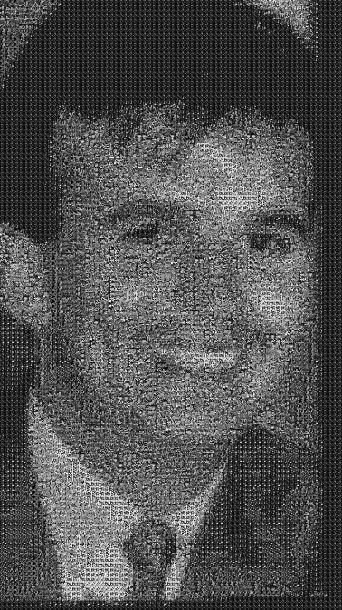
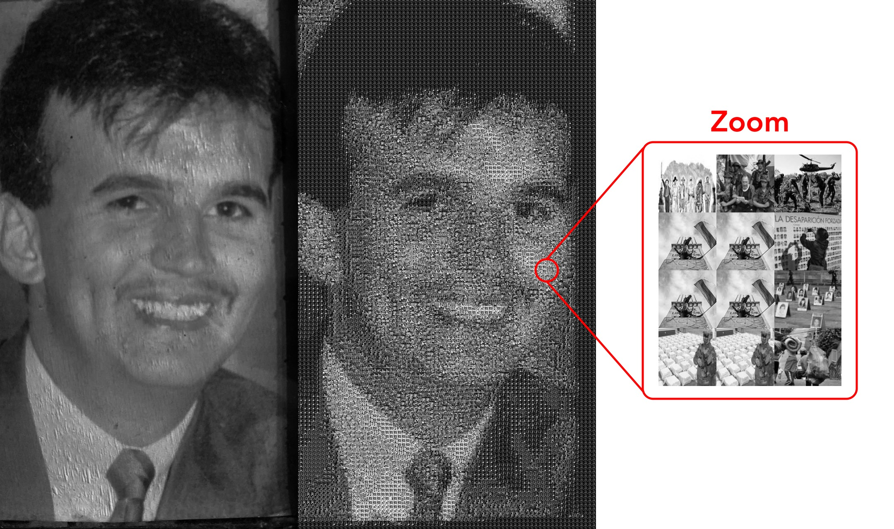

# Blog post: "Gota en un oceano..." 📝

This project intends to show how programming is a powerful tool to tell great stories, I have always thought that programming is the means but not the end. What I mean by this is that programming is the vehicle to achieve great things. In this case, I use my knowledge in programming to make my story have more impact and achieve a greater reach.

If you came here it could be for two reasons. The first is that you want to read only my essay, so I invite you to jump to the 
<a href=#blog_post>Blog Post</a>. The other possibility is that you had come to know my technical skills (possibly you came because of my portfolio), if so, I also invite you to read the 
<a href=#blog_post>Blog Post</a>, because it will make more sense why I developed the code, besides you will be able to know different uses of the programming to which we are familiarized, which in this case is to tell a story and make a great reflection. If you don't have time, jump to
<a href=#blog_demo>Blog demo</a> and 
<a href=#explaining_the_code>how the code works</a>. It does not go through much detail in the technical aspects since it is not the main objective of this project.

<h1 id='blog_demo'>
Blog demo 🎥
</h1>

To be straightforward, the code of this project is divided into two:
The one found in this repository simulates the UI of a blog on the internet and the one found in this
<a href="https://github.com/santiagobedoa/photomosaic_generator" target="_blank">repository</a>
creates the photomosaic.
Here is a demo of what the blog interface looks like:

<video width="320" height="240" controls>
	<source src='./images/video.mp4' type='video/mp4'>
</video>

This interface is fully functional. As you can see in the video, I incorporated Disqus so that people can comment, give likes, and thus add more interactivity to the blog. Also, use the facebook and twitter APIs so that people can share the post.

From now on I will switch to Spanish since the audience for this post is mainly Spanish-speaking. If you are a reader who only speaks English, I invite you to activate the translation of your browser.

<h1 id='blog_post'>
Blog Post... 🖋️
</h1>
<article>
	

		<figure>
			
			<figcaption><em>ilustración 1</em></figcaption>
		</figure>
	
 <!--- ilustración 1--->
	<h1>Gota en un océano</h1>
		

			Cuando la profe propuso que hiciéramos un trabajo en el que expresáramos cómo en algún
			momento de la historia colombiana, una situación característica de nuestro país nos había afectado
			a nosotros o nuestras familias, solo podía pensar en el hombre de la foto
			(<em>ilustración 1, clic sobre la imagen para agrandar</em>). Este caballero se llamaba Manuel Jaramillo, un pariente que
			jamás conocí.
		

		

			Soy Santiago Bedoya Arias, tengo 23 años y me encuentro terminando mi carrera universitaria
			en Administración de Negocios. Nací y crecí en Rionegro, Antioquia. Para mí es un pueblo,
			para otros ya es una ciudad. Se encuentra a 40 minutos de Medellín. Para los que no son de
			esta zona seguramente han oído hablar de este lugar, ya que aquí se encuentra el aeropuerto
			internacional José María Córdoba, uno de los principales de Colombia.
		

		

			Rionegro puede considerarse un pueblo en expansión, en los últimos años ha presentado un crecimiento poblacional y económico acelerado. La inversión pública es elevada, tiene zonas industriales pujantes y cada vez goza de más lugares para distraerse como centros comerciales, restaurantes y teatros. En términos generales Rionegro es un buen vividero, el sueño de muchas personas es tener su hogar aquí, sobre todo para quienes están en la ciudad.
		

		

			Siempre he llevado una vida tranquila, pues este lugar es bastante seguro y se aleja de muchos de los males que tienen las grandes ciudades. Sin embargo, esto no fue siempre así. Hace no muchos años, el Oriente Antioqueño y otras regiones del país estaban cayendo en manos de las FARC y el ELN. Esto condujo al nacimiento de varios grupos de autodefensas que posteriormente se unirían hasta llegar a llamarse Autodefensas Unidas de Colombia (AUC) y así agravándose la crisis de violencia que vivía el país.
		

		

			La historia de Manuel comienza cuando mi madre junto a sus primas deciden emprender y establecen un cultivo de exportación de flor nacional. Un día común y corriente, Diana Jaramillo (una de las socias) estaba saliendo de la empresa en su vehículo cuando fue acorralada por varios hombres que portaban armas de fuego, fue secuestrada el 10 de octubre de 1998 por delincuentes que después la venderían al frente 47 de las FARC. El único canal que tenía mi familia para “comunicarse” con ella era mediante el programa radial
			<em>“Las voces del secuestro”</em> (organización creada por Herbin Hoyos para que las personas pudiesen dejar mensajes a los seres queridos que se encontraban secuestrados). Al quinto mes desde que Diana fue capturada, mi familia pudo comenzar a negociar su rescate junto con la ayuda de Alex Lopera quien era el mediador de paz para Antioquia y cumpliría el papel de intermediador entre las FARC y mi familia.
		

		

			Una vez llegado a un acuerdo, Manuel quien era hermano de Diana, insistía en acompañar al grupo rescatista que llevaba el dinero a pesar de que Alex no estaba de acuerdo, pues este insistía que algo malo le podría suceder si los acompañaba, pero a pesar de las advertencias, no hubo poder humano que lo hiciera cambiar de opinión.
		

		

			En la mañana del 10 de marzo de 1999, transcurridos 6 meses desde el secuestro, Manuel junto a Alex y Luis Fernando Londoño (quien cumplía el papel de guía) emprendieron camino a Sonsón donde se encontraría con el frente 47 de las FARC para entregar el dinero en efectivo. Los rescatistas por precaución, decidieron esconder el dinero en los neumáticos de la camioneta en la que se movilizaban y así evitar que alguien los robara.
		

		

			A la una y media de la madrugada, Fabiola (madre del mediador de paz) recibe una llamada:
			“Aló, aló, ¿aloooo Alex, Alex, hijo eres tú? - preguntó con aprensión.
			Una voz débil, quejumbrosa fue lo que escuchó al otro lado de la línea.
			- Pero ¿dónde estás? Qué te pasa hijo, ¿qué te pasa?, preguntaba la madre con insistencia sin obtener respuesta alguna. La llamada se perdió”.
			<a href="https://www.eltiempo.com/archivo/documento/MAM-913476">(Revista El Tiempo, 1999)</a>.
			Esto fue lo último que se supo de ellos.
		

		

			Transcurridos varios días desde la desaparición, La familia de Alex junto a la mía acuden a las autoridades y se comienza a realizar una investigación. Después de hacer averiguaciones en la zona, unos campesinos testifican que el ejército había detenido el vehículo en el que se movilizaba el grupo rescatista y los dejan casi todo el día esperando, luego les permiten continuar, pero más adelante los detienen nuevamente otros soldados (esta vez de manera informal) y les dispararon sin piedad. Los uniformados sacan las bolsas de los neumáticos y luego hacen que la camioneta caiga por un desfiladero de 40 metros. Manuel y Luis murieron al instante, Alex permaneció un tiempo más con vida y pudo realizar la última llamada de su vida a su madre.
		

		

			Al parecer había un informante que infiltró la cantidad de dinero que se llevaba en el carro y fue el mismo ejército quien ejecuto el robo y cometió el asesinato de los tres hombres. Esto se supo gracias a que uno de los soldados involucrados conocía a Manuel y dio su testimonio a las autoridades, luego se le unieron otros compañeros para hablar de lo sucedido.
		

		

			En una impresión de la revista el tiempo publicado el 29 de junio de 1999 se puede leer:
		

		

			<em>
				‘’La Fiscalía General de la Nación dictó medida de aseguramiento de detención preventiva, sin beneficio de excarcelación, contra el soldado profesional Carlos Mario Escudero Cano, sindicado de ser el autor material de la muerte de las tres personas y de haberse apropiado de 150 millones de pesos.
				La misma providencia de la Fiscalía profirió igual medida contra el sargento viceprimero, Edgardo Enrique Barón Otero y contra los soldados, Gerardo González Zuluaga y Ferney Alberto Cardona Acevedo, como supuestos responsables de encubrimiento y participación en el robo.
				Por el múltiple crimen y hurto también tienen medida de aseguramiento el mayor David Hernández Rojas y el capitán, Diego Fernando Fino Rodríguez, comandantes militares en la zona.
				Todos están detenidos en distintas guarniciones militares de Antioquia, donde tienen libertad de movilización y comunicación, a la espera de ser llamados a juicio por la justicia ordinaria. Esta circunstancia pudo facilitar la evasión este fin de semana del mayor Hernández Rojas, quien se encontraba en las instalaciones del Batallón Yariguíes, dentro de la Cuarta Brigada.
				Según informó el comandante de esta unidad militar, general Eduardo Herrera Verbel, el pasado domingo detectaron la ausencia de Hernández Rojas y de inmediato impartió órdenes orientadas a su recaptura, así como una investigación por la fuga‘’.
			</em>
		

		

			Si, el
			<em>Mayor</em>
			hasta el día de hoy sigue libre y no ha pagado por el crimen que cometió. Sin embargo, lo que más me conmueve es que esto es pan de cada día en nuestro país, basta con solo poner el noticiero (cualquiera que sea) para darnos cuenta de que se cometen muchos actos de violencia y corrupción, y en la mayoría de los casos nadie paga por ello. Para liberar a Diana mi familia tuvo que pagar el rescate nuevamente y aunque a mí no me toco vivir nada de esto, si me ha afectado bastante, ya que a raíz del secuestro la mayoría de mi familia decidió huir del país y cortar cualquier conexión con Colombia.
		

		

			Nunca me ha faltado un hogar y jamás he pasado algún tipo de necesidad. Sin embargo, este es el caso atípico, la mayoría de las personas que son desplazadas de sus hogares por la violencia, cuando “deciden” abandonar su hogar dejan todo lo que tienen, se van sin nada, sin saber a donde van a llegar y como van a vivir. Según el informe
			<a href="http://www.centrodememoriahistorica.gov.co/descargas/informes2015/nacion-desplazada/una-nacion-desplazada.pdf"> <em>Una Nación Desplazada</em></a>,
			más de seis millones y medio de personas se han visto forzadas a desplazarse dentro y fuera del territorio nacional y esta cifra es solo hasta el 2014. Hasta el día de hoy son muchos los millones de colombianos que han tenido que abandonar sus hogares, sus bienes y costumbres, dejando todas sus costumbres y forma de vida atrás.
		

	<h2>De la intención al arte</h2>
		

			La violencia en mi país se ha vuelto paisaje, desde pequeño, hasta el día de hoy, he escuchado a diario noticias sobre homicidios, atentados, desplazamiento, delincuencia, narcotráfico, corrupción y muchos más temas que en otros lugares serian inconcebibles. La historia de Manuel es una de las muchas que existen. Es lo mas cerca que he estado de la violencia, el conflicto interno nunca me ha afectado de forma directa. Esto me ha hecho perder la empatía hacia mi país, he llegado al punto de ignorar todo lo que sucede y de dar por sentado todas las cosas malas que suceden.
		

		

			Se que como yo hay muchísimas personas que están tranquilas en sus hogares, que no se incomodan preguntándose ¿qué está pasando en nuestro país?, no les interesa conocer el dolor que viven millones de colombianos y se sienten cómodos con llevar esta vida. Incluso, cuando observo a mi alrededor, veo un montón de padres que ocultan a sus hijos todo lo que pasa, e hijos que no quieren incomodarese con la verdad. Considero que esto es un problema bastante serio, ya que quienes tienen mayores oportunidades no se preocupan por los que están abajo, estamos creando una desconexión entre clases y esto intensifica la polarización. El primer paso para resolver un problema es reconocer su existencia, y estamos haciendo todo lo contrario, ni nos interesa ni queremos reconocer nuestro papel, todos los colombianos tienen la misma responsabilidad a la hora de crear paz.
		

		

			<figure>
				
				<figcaption><em>ilustración 2</em></figcaption>
			</figure>
		
 <!--- ilustración 2--->
		

			Desde que comencé a hacer este trabajo, he leído varias noticias e informes para sacar datos y apoyar mis ideas. Y sucedió algo que no me esperaba, me volví mucho más sensible a la hora de procesar la información. He comenzado a cuestionar muchas cosas que considero que hemos normalizado.
		

		

			Cuando buscas en Google “homicidios en Colombia”, “desplazamiento en Colombia” o “violencia en Colombia” la cantidad de noticias que encuentras es sorprendente, la lista pareciera no tener fin y esto sin tener en cuenta lo que se escucha en la radio o lo que se ve en la televisión. Cada caso pasa de ser una tragedia a una estadística.
		

		

			Me detuve un día a pensar como podría llevar esta situación a una expresión artística, pues considero que el arte es el nivel más alto que tiene el ser humano para abrirse a los demás y expresar sentimientos e ideas. Desafortunadamente nunca he sido muy bueno con las manos para pintar o realizar manualidades, tampoco me considero muy elocuente para dar un discurso o escribir un poema. Así que me pregunté ¿en qué soy bueno?, ¿qué es lo que me gusta hacer? Y ¿cómo podría llevarlo al nivel artístico? Así fue como surgió la
			<em>ilustración 2</em>.
		

		

			La fotografía que ven en realidad es un fotomosaico. En el mundo de las imágenes artísticas, este estilo es conocido por poder visualizar una imagen principal cuando se observa de lejos, pero inmediatamente te acercas, puedes ver que está compuesta por cientos (o miles) de pequeñas imágenes, así que en su conjunto forman una imagen principal, pero desde lo particular son imágenes independientes.
		

	<h2>Explicando el fotomosaico</h2>
		

			<figure>
				
				<figcaption><em>ilustración 3</em></figcaption>
			</figure>
		
 <!--- ilustración 3--->
		

			El fotomosaico <em>(ilustración 2)</em> está compuesto por cien imágenes y fotografías diferentes que fueron extraídas de noticias en internet, las cuales hablan sobre la violencia y los problemas sociales que existen en Colombia.
			La <em>ilustración 3</em> nos permite ver de forma intuitiva lo que se explicó anteriormente. Cómo podemos observar, el fotomosaico está compuesto por una gran cantidad de pequeñas fotos e imágenes, que en su conjunto recrean la foto original de Manuel. En palabras sencillas es como si cada píxel fuese reemplazado por una imagen de alguna de las noticias que se buscaron en internet. Obsérvese el
			<strong>"Zoom"</strong> que se hace en el pómulo de Manuel, aquí se pueden ver las fotos individuales que componen esta parte del fotomosaico.
		

		

			Tuve que desarrollar un algoritmo utilizando el lenguaje de programación Python para poder crear el fotomosaico. El script se ocupa de extraer fotos de internet en los temas especificados por el usuario y de recrear la fotografía que se le pase como input, que en este caso es la de Manuel. El output sera la imagen en estilo de fotomosaico.
		

	<h2 id='explaining_the_code'>¿Cómo funciona el código?</h2>
		

			El programa se divide en tres:
		

		<!--- Pasos de como funciona el código --->
			<h3>1.	Reunir las imágenes que se utilizarán para alimentar el fotomosaico</h3>
				

					Para poder realizar la obra, primero se debe recolectar una gran cantidad de imágenes. Para conseguirlas, desarrollé un robot (web scraping) que busca en Google las noticias más relevantes en los siguientes temas: violencia en Colombia, secuestros en Colombia, desplazamiento forzado en Colombia, desaparecidos en Colombia y narcotráfico en Colombia. Por cada tema el robot selecciona las primeras 20 noticias que aparecen en Google y extrae sus imágenes (una imagen por noticia) y las guarda en una carpeta que al final del proceso contendrá cien elementos (5 temas y 20 imágenes por cada tema).
				

			<h3>2.	Convertir las imágenes extraídas en el paso anterior a escala de grises</h3>
				

					Como la foto de Manuel se encuentra en escala de grises (lo que comúnmente llamamos blanco y negro) fue necesario editar las imágenes extraídas de internet, pasándolas de color a escala de grises. Para cumplir con esta tarea, creé una función que se encarga de hacer la edición para las cien imágenes y así evitar hacerlo manualmente.
				

			<h3>3.	Crear el fotomosaico</h3>
				

					Ya una vez que tuve las imágenes en escala de grises, el script toma la imagen input como referencia, y utiliza el banco de imágenes (las 100 imágenes extraídas de internet) para extraer fotos y ordenarlas de la mejor manera para que en conjunto representen el input y así, obtendremos el fotomosaico (output).
				

		<!--- FIN Pasos de como funciona el código --->
		

			<strong><em>Importante:</em></strong>
			Si deseas ver más sobre el código o quisieras probarlo con tus propias imágenes, puedes encontrarlo en
			<a href="https://github.com/santiagobedoa/photomosaic_generator" target="_blank">GitHub</a>.
			Si visitas el repositorio, te sugiero que hagas clic sobre la imagen "output" que se encuentra de ejemplo y así podrás ver el fotomosaico en alta definición.
		

	<h2>Reflexión</h2>
		

			Comencé este relato contando la historia de mi familia. A lo largo del proceso me di cuenta de que solo es una de las muchas historias que hay. Me parecía injusto hacer un homenaje solo a Manuel cuando hay millones de personas y familias que han pasado por situaciones mucho más difíciles. El fotomosaico de Manuel es una buena aproximación a la intención de este trabajo. Si nos quedamos en lo superficial solo vemos nuestra historia, solo nos quedamos con nuestra experiencia, creyendo que nos ha tocado vivir algo difícil y preguntándonos ¿Por qué a mí?, ¿Por qué a mi familia?, pero en el momento en que nos detenemos a observar con mayor atención, cuando nos informamos un poco, nos damos cuenta de que solo es una
			<strong style="color: #e31c3d">gota en un océano</strong> de historias.
		

</article>